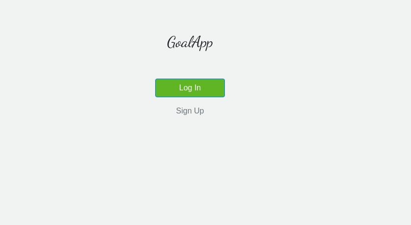
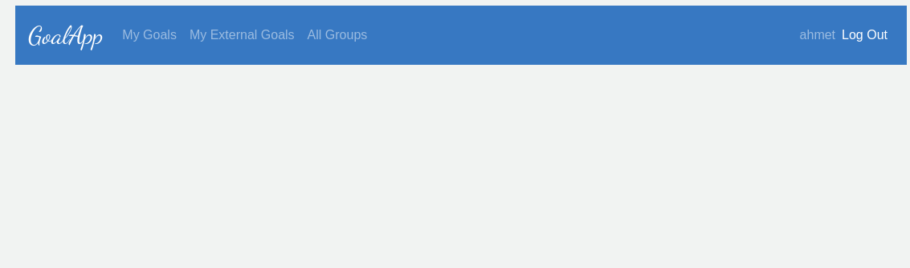
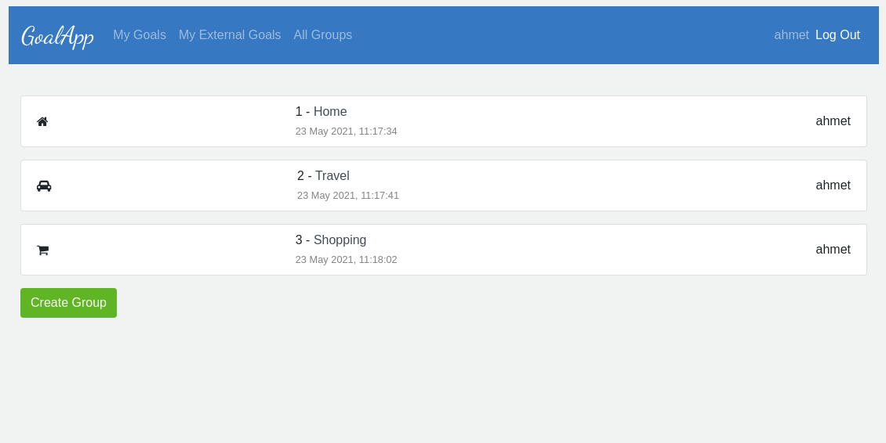

<p align="center">
    <h1 align="center"> Goal App  </h1>    
</p>




Goal App is a web application with responsive behavior for mobile usage built with <b>Ruby on Rails</b> 

You can find the full requirements <a href="https://www.notion.so/microverse/Group-our-transactions-ccea2b6642664540a70de9f30bdff4ce" alt="Requirements">here</a>. Exploring this project you can find these options (<b>sign-up</b>, <b> sign-in</b>,<b> all my goals</b>,<b> all my external goals</b>,<b> all groups and log out</b>) 

## Presentation

Click on the link to see [presentation](https://www.loom.com/share/66dfcf1f0a4b46a392538a903abef954)

## Live Version

Click on the link to see  [live version](https://goal-appp.herokuapp.com)

## Getting Started

This project was built using Ruby and Rails version 6, it is a web application and for running on your local environment you should follow these guidelines.

### Prerequisites

- Ruby 2.7.2
- Rails 6.1.3.2
- Git

### Setup

+ Clone the project using this command.


> Using SSH 
```
git clone  https://github.com/ahmetbozaci/goal-app.git
```

> Using HTTPS
```
git clone  git@github.com:ahmetbozaci/goal-app.git
```

+ Change to the parent directory of the project using 

```
cd /home/workspace/Project-name
```

## Install

>  Install the needed gems:

```
bundle install --without production
```

>  Migrate the database:

```
rails db:migrate
```

>  Install webpacker

```
rails webpacker:install
```

### Run tests

>  Run the test suite to verify that everything is working correctly:

```
bundle exec rspec
```

>  If the test suite passes, you'll be ready to run the app in a local server:

```
rails server
```

## Authors

👤 **Ahmet Bozacı**
- Github:[@ahmtbozaci](https://github.com/ahmetbozaci)
- Twitter:[@ahmtbozaci](https://twitter.com/ahmtbozaci)
- LinkedIn:[@ahmtbozaci](https://www.linkedin.com/in/ahmetbozaci/)

## 🤝 Contributing

This project was created for educational purposes as part of the Microverse web development curriculum; contributing is not accepted.

Feel free to check the [issues page](https://github.com/ahmetbozaci/goal-app/issues).

## Show your support

Give a ⭐️ if you like this project!

## Acknowledgments


## 📝 License

This project is [MIT](https://github.com/ahmetbozaci/goal-app/blob/feature/setup/LICENSE) licensed.

